# Benchmarking RAG/GRAPH RAG/HYBRID RAG

# Overview

This repository benchmarks three Retrieval-Augmented Generation (RAG) pipelines—GraphRAG, Vector-DB RAG, and Hybrid RAG—over the same document collection and Q-and-A set.
It ingests a PDF, splits it into fixed-size text chunks, embeds those chunks with a Sentence-Transformers encoder, stores them in Neo4j both as nodes and as a vector index, and then asks several IBM watsonx and OpenAI models to answer every question in a CSV.
Each answer is automatically graded by GPT-4o, and a leaderboard is written to disk for reproducibility.

GraphRAG was introduced by Microsoft Research to combine graph analytics with LLM prompting for richer retrieval and summarisation.  

⸻

# ✨ Key Features
| **Feature** | **Implementation** |
|-------------|-------------------|
| **Multi-model support** | IBM Granite, Mixtral-8×7B, Llama-3-405B, Granite-Vision, Granite-Code, plus OpenAI GPT-4o |
| **Vector search** | Neo4j 5 native vector index with cosine similarity |
| **Graph-aware retrieval** | Leiden community detection for well-connected topic clusters |
| **Sentence embeddings** | all-MiniLM-L6-v2 (384-D) for fast, low-memory semantic search |
| **Hybrid RAG** | Runs GraphRAG over the top-k chunks returned by the vector index |
| **Automatic scoring (LLM-as-a-Judge)** | GPT-4o grades each candidate answer with 1 / 0 similarity |
| **Full audit trail** | Every console line is intercepted and copied to a timestamped `.txt` artefact |


⸻

# 📚  Architecture

```mermaid
graph TD
    %%----------- Ingestion -----------%%
    subgraph Ingestion
        A[PDF / TXT] -->|PyMuPDF / aiofiles| B[Raw Text]
        B -->|FixedSizeSplitter| C[Chunks 500±10 tokens]
        C -->|MiniLM Embedding| D[(384-D Vector)]
        C -->|Cypher| E["(:Chunk)<br/>text + id"]
        D -->|Cypher| E
    end

    %%----------- Retrieval -----------%%
    subgraph Retrieval
        F["Neo4j<br/>Vector Index"] <-->|cosine k=20| Q[Query Vector]
        F -->|Top-k Chunks| C2[Chunk Subset]
    end

    %%----------- GraphRAG -----------%%
    subgraph GraphRAG
        C --- G["Build Similarity Graph<br/>(sim > 0.8)"]
        G -->|Leiden| H[Communities]
        H -->|LLM summarise| I[Community Summaries]
        I -->|LLM partial answers| J[Global Answer]
    end

    %%----------- VectorRAG -----------%%
    subgraph VectorRAG
        C2 -->|Concat| K[Context]
        K -->|LLM answer| L[Answer]
    end

    %%----------- Hybrid RAG -----------%%
    subgraph Hybrid
        C2 --> G2["Build Similarity Graph"]
        G2 -->|Leiden| H2[Communities]
        H2 -->|LLM summarise| I2[Community Summaries]
        I2 -->|LLM partial answers| J2[Global Answer]
    end

    %%----------- Scoring -----------%%
    J --> S[GPT-4o Scorer]
    L --> S
    J2 --> S
    S --> T[Leaderboard.txt]
```



⸻

# 1 Prerequisites
	•	Python 3.10+
	•	Neo4j 5.16+ with APOC & vector indexes enabled
	•	GPU-class device is optional; Apple Silicon users get MPS acceleration automatically.
	•	Set the following environment variables in a .env file:
```bash
NEO4J_URI=bolt+s://<host>:7687
NEO4J_USERNAME=<user>
NEO4J_PASSWORD=<pass>

WATSONX_URL=https://eu-de.ml.cloud.ibm.com
API_KEY=<your_ibm_cloud_api_key>
PROJECT_ID=<watsonx_project_id>
OPENAI_API_KEY=<openai_api_key>

SELECTED_MODEL=granite   # one of: code, mistral, granite, granite_vision, llama, chat_gpt
```


⸻

# 2 Installation
```bash
git clone https://github.com/your_org/graph-rag-benchmark
cd graph-rag-benchmark
python -m venv .venv && source .venv/bin/activate
pip install -r requirements.txt
```
Neo4j will build the vector index the first time you run the script; this happens in the background and may take a few minutes on large corpora.   

⸻

# 3 Running the Benchmark

python main.py 

	•	PDF path and CSV path are hard-coded near the top of main()—adjust as needed.
	•	A full log and the per-pipeline scores are written to
GRAPHRAGvsRAGvsHYBRID-<model>.txt.

⸻

# 4 Understanding the Pipelines

## 4.1 GraphRAG

Combines text-to-graph extraction, network analysis, and LLM summarisation to capture long-range discourse structure that plain vector search might miss.   

## 4.2 Vector-DB RAG

Retrieves the k most similar chunks from the Neo4j vector index and feeds them—verbatim—into the language model. This is fast but can introduce contextual noise if unrelated passages share vocabulary.   

## 4.3 Hybrid RAG

Uses vector search for recall and GraphRAG for precision, giving better topic coherence while keeping latency acceptable.

⸻

# 5 Configuration Knobs

Variable / Flag	Default	Description
RETRIEVAL_TOP_K	20	No. of chunks pulled from Neo4j for Vector & Hybrid RAG
SIM_THRESHOLD	0.8	Cosine-similarity cut-off when creating graph edges
MAX_NEW_TOKENS	10 000	Decoding guard-rail for IBM watsonx models
torch.set_num_threads	2	Caps intra-op parallelism for deterministic runs


⸻

# 6 Extending the Project
	1.	Swap Embeddings Replace all-MiniLM-L6-v2 with any other SentenceTransformer model; dimensions are picked up automatically.   
	2.	Plug in a different judge evaluate_answer() expects any LLM exposing invoke().
	3.	Fine-tune thresholds  0.8 works well on technical prose, but you may need 0.6–0.75 for news articles.
	4.	Multiple documents Iterate over a directory and keep the same Neo4j driver open.

⸻

# 7 Performance Notes
	•	The Leiden algorithm yields better-connected communities and faster runtimes than Louvain, making it a good default for large corpora.  
	•	MiniLM embeddings strike an excellent speed/quality balance for semantic search on CPUs.  
	•	GPT-4o is used solely for grading, exploiting its multi-modal reasoning without consuming context tokens in the retrieval step itself.  

⸻

# 8 License

Apache 2.0 – see LICENSE for details.

⸻

# 9 Acknowledgements
	•	Microsoft Research for GraphRAG.  
	•	Neo4j Labs for first-class vector support.  
	•	IBM watsonx.ai for Granite family models.  
	•	OpenAI for GPT-4o.  
